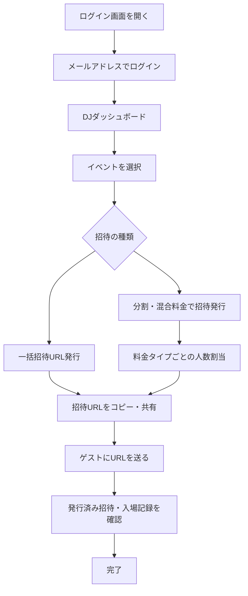

# 使用マニュアル：DJ画面

**対象読者**: DJ（招待URLを発行し、ゲストの入場状況を確認する方）

---

## 操作フロー図

---

## ログイン・アクセス

1. ブラウザで **http://womb.minami-umemoto.jp/login** を開く
2. メールアドレスに **dj@example.com** を入力
3. ログインを実行（本プロトタイプは簡易認証のため、パスワードを求めない場合があります）
4. ログイン後、**DJ画面**（ダッシュボード）に遷移します

---

## 画面の見方

- **ヘッダー**: 管理画面 / DJ画面 / ENTRANCE へのリンク、ログアウト
- **DJダッシュボード**: 自分が担当するイベント一覧が表示されます。イベントを選択すると、そのイベント向けの招待発行・確認ができます
- **割当て＆招待URL発行**: 代表者ごとに人数・料金タイプを割り当て、招待URLを発行できます
- **発行状況・入場記録**: 発行した招待の一覧や、各招待の入場状況（入場済み人数など）を確認できます

（画面キャプチャは別途キャプチャして `images/` に配置してください。※あとで画面スクショを添付する予定。）

---

## 割当て＆招待URLタブで確認できる項目と内容

このタブでは、管理画面で設定された「自分の割り当て」の確認と、招待URLの発行ができます。

1. **割り当て内容**（このイベントで自分が発行できる枠）
   1. 料金タイプ名（フリー／ディスカウント等）
   2. 料金（1名あたり・円）
   3. 招待上限人数（この料金タイプで発行できる総人数）
   4. 発行済み人数（すでに発行した招待で使った人数）
   5. 残り発行可能人数（あと何人まで発行できるか）

2. **招待URL発行フォーム**
   1. ゲスト代表者名（入力必須）
   2. 料金タイプごとの人数（混合料金時は各プランの名数を入力。残り枠が表示される）
   3. 合計人数（入力した料金タイプ別人数の合計）
   4. 「招待URL発行」ボタン（押下で招待が作成され、発行状況タブでURLをコピーできる）

※割り当てが未設定の場合は「管理画面でDJをイベントに割り当ててください」と表示されます。

---

## 発行状況＆入場記録タブで確認できる項目と内容

このタブでは、自分が発行した招待の一覧と、エントランスで読み取られた入場ログを確認できます。

### 発行状況（テーブル）

1. **ゲスト代表者名** … 招待の親の名前。分割入場時は子代表者名が下に表示される
2. **ステータス** … 招待の状態（未確認・確認済み・完了等）。親・子ごとに表示される場合あり
3. **総人数** … その招待の総人数（名）
4. **プラン別割当** … 料金タイプごとの人数（例: フリー×2名、2000円×1名）
5. **入場人数** … すでに入場した人数。親・子の内訳が表示される場合あり
6. **残利用可能人数** … まだ入場できる人数。親・子の内訳が表示される場合あり
7. **招待URL** … 「URLをコピー」ボタンで招待URLをクリップボードにコピーできる
8. **合計行** … 総人数・入場人数・残りの合計

### 入場記録（テーブル）

9. **ゲスト代表者名** … 招待の親の名前
10. **分割入場代表者名** … 子で入場した場合の代表者名（一括の場合は「-」等）
11. **入場タイプ** … 親／子／一括／分割などのラベル
12. **入場人数** … その回の入場人数（名）
13. **男性** … 入場時の男性人数（名）
14. **女性** … 入場時の女性人数（名）
15. **スキャン時刻** … QRスキャンされた日時
16. **合計行** … 入場人数・男性・女性の合計

※あとで画面スクショを添付する予定。

---

## よくある操作

### 招待を発行する

1. DJダッシュボードでイベントを選択
2. ゲスト代表者ごとに人数と料金タイプ（フリー／有料など）を割り当て
3. 発行された招待URLをコピーしてゲスト代表者へ渡す

### 発行済み招待・入場記録を確認する

1. DJダッシュボードでイベントを選択
2. 「発行済み招待」や「入場記録」のセクションを表示
3. 各招待の状態（未確認・確認済み・入場済み）や入場人数を確認

---

## 用語・注意事項

- **料金タイプ**: イベント側で定義されたプラン（例: フリー、〇〇円）。招待発行時に「何人をどの料金タイプで入れるか」を割り当てます。
- 招待URLは **http://womb.minami-umemoto.jp/guest/{token}** の形式です。ゲストに渡す際はURL全体をコピーして共有してください。
