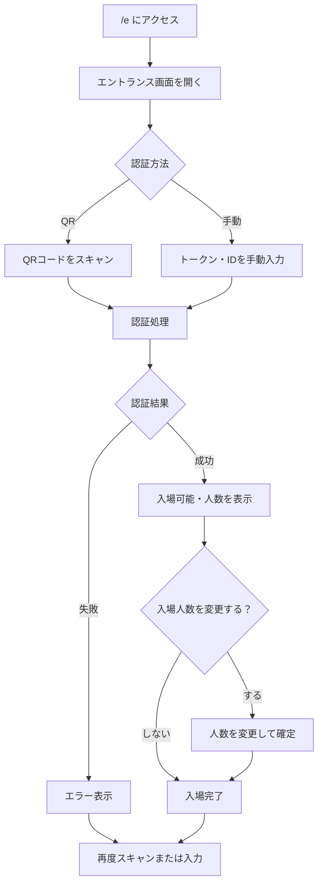

# 使用マニュアル：エントランス画面

**対象読者**: エントランススタッフ（入場口でゲストのQRを読み取り、認証結果を確認する方）

---

## 操作フロー図

---

## ログイン・アクセス

- **URL**: **http://localhost:5173/e**
- ログインは不要です。ブラウザで上記URLを開くとエントランス用画面が表示されます。

---

## 画面の見方

- **メインエリア**: QRスキャン用の入力欄、または手動でトークン・IDを入力する欄が表示されます
- **認証結果**: スキャンまたは入力後に、認証が成功したかどうかが表示されます
  - **成功時**: ゲスト名・入場可能人数・招待の概要などが表示されます。入場人数を変更するオプションがある場合は、変更してから「入場」を確定します
  - **失敗時**: エラーメッセージが表示されます。URLの有効期限切れ・重複入場などの理由が示される場合があります
- **入場人数変更**: 認証成功後、実際の入場人数を変更できる場合があります。変更して確定すると、その人数で入場記録が残ります

**この画面で確認できる項目と内容**

- **スキャン・入力画面（初期表示）**
  1. タイトル（エントランス - QRコード認証）
  2. 「QRコードスキャン」見出し
  3. カメラ起動ボタン（カメラ停止ボタンはカメラ起動中に表示）
  4. QRコードデータ入力欄（手動入力またはスキャン結果を貼り付け。形式: qr_token:temporary_token:timestamp）
  5. 「認証」ボタン
  6. 案内文（カメラでスキャンするか手動入力するかの説明）
  7. エラーメッセージ（認証失敗時などに表示）

- **認証後・入場内容確認画面**
  1. メッセージ（認証成功。内容を確認して入場を確定してください。）
  2. 「入場内容確認」見出し
  3. 認証ゲスト名
  4. 招待情報ブロック: ゲスト代表者名、分割入場代表者名（該当時）、入場タイプ、現在の累計入場人数、残り人数、総人数
  5. 料金（QRコード連携）: プラン別の名数・単価・金額、合計料金
  6. 料金タイプ別人数（混合料金時）: 各料金タイプの入場人数の確認・修正（合計＝入場人数、上限あり）
  7. 男性人数・女性人数の入力欄（合計が入場人数と一致するか表示）
  8. 受付スタッフ名（任意）
  9. 「入場確定」ボタン、「キャンセル」ボタン
  10. 合計料金の表示

- **入場確定結果画面**
  1. 成功メッセージ（認証成功！）
  2. 「入場確定結果」見出し
  3. ゲスト名、入場タイプ（親ゲスト／子ゲスト）、入場人数、男性・女性の内訳、累計入場人数、残り人数、総人数

（画面キャプチャは別途キャプチャして `images/` に配置してください。）

---

## よくある操作

### エントランス画面を開く

1. ブラウザで **http://localhost:5173/e** を開く
2. ログインせずにエントランス用の画面が表示されます

### QRコードで認証する

1. 画面の「QRをスキャン」またはカメラ／入力欄を有効にする
2. ゲストが表示した入場用QRコードを読み取る（またはゲストがQR画面のURLをバーコードとして表示している場合はそのURLを読み取る）
3. 認証結果が表示されます。成功なら入場可能人数などを確認し、必要に応じて人数を変更してから入場を確定します

### 手動でトークン・IDを入力して認証する

1. 画面の手動入力欄に、ゲストの入場用トークンやIDを入力
2. 認証を実行する
3. 認証結果を確認し、成功時は入場人数を確認・変更してから入場を確定します

### 認証結果の確認

- **成功**: ゲスト名・入場可能人数が表示されます。問題なければそのまま入場処理を完了します
- **失敗**: メッセージを確認し、ゲストに再度QRの表示やURLの確認を依頼するか、スタッフ側で入力ミスがないか確認します

### 入場人数を変更する

1. 認証成功後、入場人数が表示される
2. 実際の入場人数と異なる場合は、変更欄で人数を修正
3. 「確定」や「入場」ボタンで入場記録を確定する

---

## 用語・注意事項

- **入場用QR／トークン**: ゲストが「QR画面」タブで表示するQRコード、またはそのQRに対応するURL（トークン）です。1回の認証で、招待に紐づく「入場可能人数」までを一括で入場させることができます。
- **分割・混合料金**: ゲストが代表者を選んで表示したQRは、その代表者分の人数・料金タイプで認証されます。エントランスでは「誰（どの代表者）で何名」が入場したかが記録されます。
- 同一のQR・トークンで重複して入場処理を行わないよう、画面の表示や運用で注意してください。
