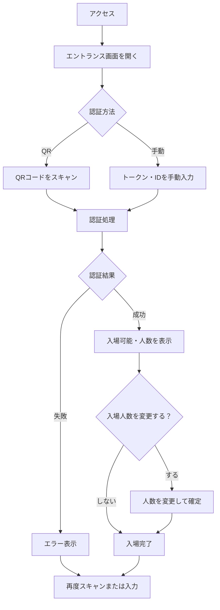
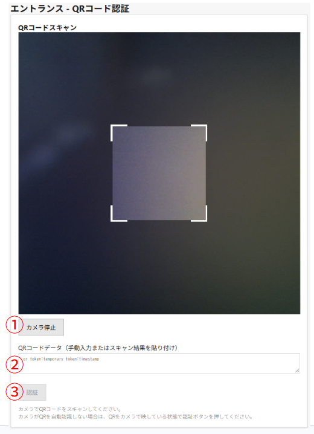
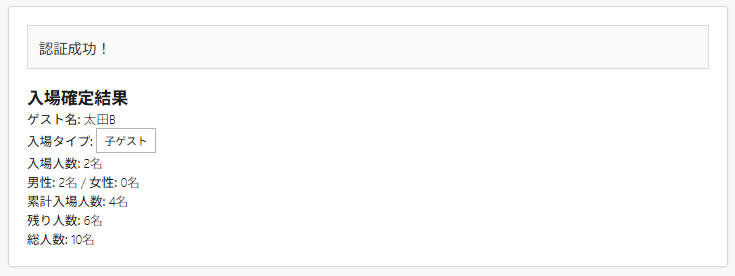

# 使用マニュアル：エントランス画面

**対象読者**: エントランススタッフ（入場口でゲストのQRを読み取り、認証結果を確認する方）

---

## 操作フロー図

---

## 操作手順

### QRコードで認証する

1. 画面の「QRをスキャン」またはカメラ／入力欄を有効にする
2. ゲストが表示した入場用QRコードを読み取る
3. **成功**: 認証成功後、入場人数が表示される
4. **失敗**: メッセージを確認し、ゲストに再度QRの表示やURLの確認を依頼→2へ戻る
5. 実際入場する男女人数を入力
6. 「入場確定」ボタンで入場記録を確定する

### 手動入力で認証する（任意）

1. 画面の入力欄にトークンまたはIDを入力
2. 「認証」ボタンを押下
3. 認証結果に応じて上記QRと同様の手順で入場人数を入力し「入場確定」

---

## 画面項目の説明

- **スキャン・入力画面（初期表示）**
  1. カメラ起動ボタン（カメラ停止ボタンはカメラ起動中に表示）
  2. QRコードデータ入力欄（手動入力またはスキャン結果を貼り付け。※動作テスト用）
  3. 「認証」ボタン
  
  
- **認証後・入場内容確認画面**
  1. メッセージ（認証成功。内容を確認して入場を確定してください。）
  2. 認証ゲスト名
  3. 招待情報ブロック: ゲスト代表者名、分割入場代表者名（該当時）、入場タイプ、現在の累計入場人数、残り人数、総人数
  4. 料金（QRコード連携）: プラン別の名数・単価・金額、合計料金
  5. 料金タイプ別人数（混合料金時）: 各料金タイプの入場人数の確認・修正（合計＝入場人数、上限あり）
  6. 男性人数・女性人数の入力欄（合計を一致させないと入場確認できません）
  7. 受付スタッフ名（任意）
  8. 「入場確定」ボタン、「キャンセル」ボタン
  9. 合計料金の表示

- **入場確定結果画面**
  1. 成功メッセージ（認証成功！）
  2. 「入場確定結果」見出し
  3. ゲスト名、入場タイプ（親ゲスト／子ゲスト）、入場人数、男性・女性の内訳、累計入場人数、残り人数、総人数

  

---

## 用語・注意事項

- **入場用QR／トークン**: ゲストが「QR画面」タブで表示するQRコード、またはそのQRに対応するURL（トークン）です。1回の認証で、招待に紐づく「入場可能人数」までを一括で入場させることができます。
- **分割・混合料金**: ゲストが代表者を選んで表示したQRは、その代表者分の人数・料金タイプで認証されます。エントランスでは「誰（どの代表者）で何名」が入場したかが記録されます。
