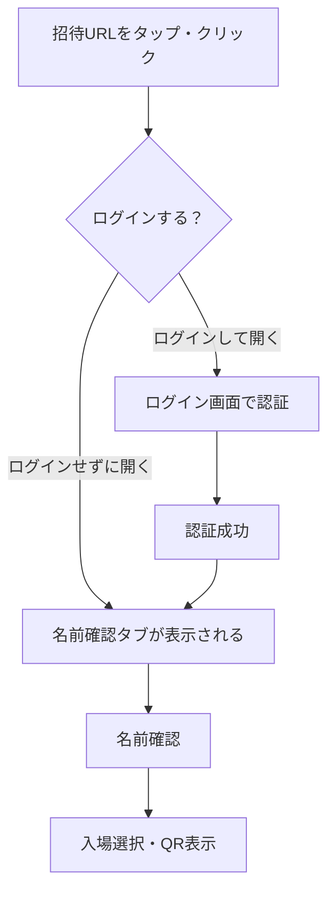
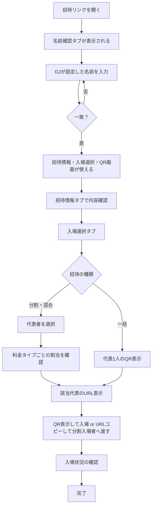
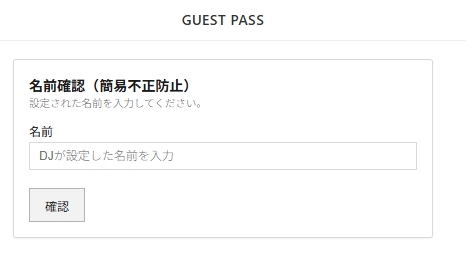
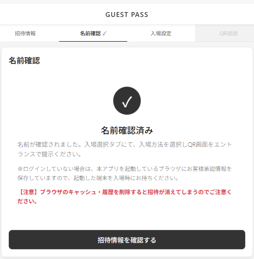
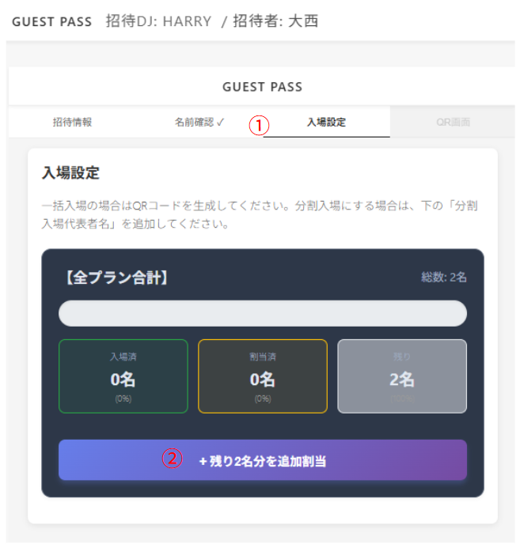
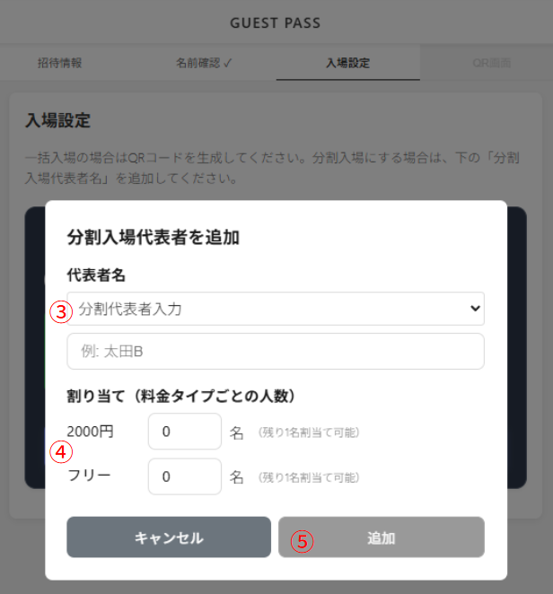
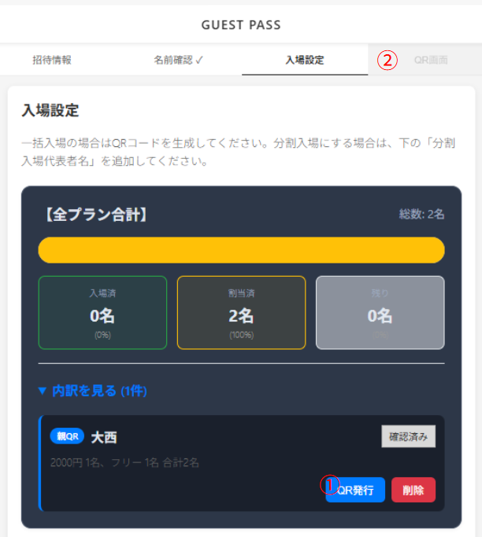
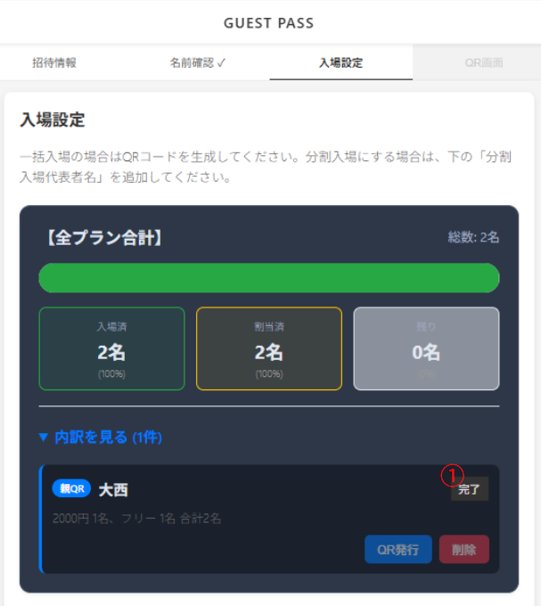
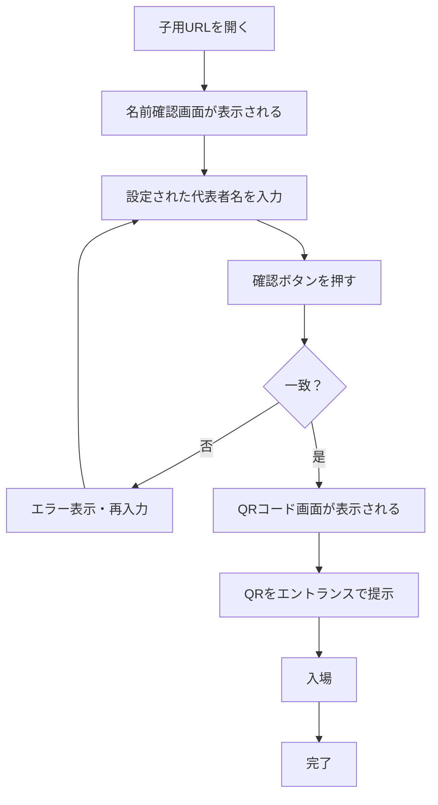
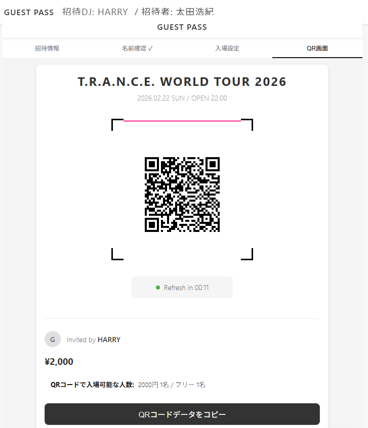

# 使用マニュアル：ゲスト画面

**対象読者**: ゲスト（招待URLを受け取り、名前確認・入場選択・QR表示を行う方。）

---

## 招待URLを開くときのフロー（ログインする／しない）

※ログインによる開き方は現在未実装です。将来の仕様として記載しています。

## 操作手順

- **ログインして開く**: 事前にアプリまたはサイトにログインした状態で招待URLを開く。名前確認後アカウントに招待が紐づけられます(未実装)
- **ログインせずに開く**: URLだけで招待画面へ直行し、名前確認から進みます。

---

## 操作フロー図（招待画面での操作）

※名前確認を通過するまで招待情報タブは表示されません。まず名前を入力してから進みます。

## 操作手順

### 招待リンクを開く

1. DJから受け取った招待URL（形式: `http://womb.minami-umemoto.jp/guest/{qrToken}`）をタップまたはクリック
2. 招待画面が開き、**名前確認**の入力が表示されます（名前確認を通過するまで招待情報タブは見えません）

### 名前を確認する

1. DJから伝えられた名前（招待時に設定された名前）を入力
2. 一致すると「入場選択」タブに進めます

### 入場設定する（代表者を選ぶ）

1. 「入場選択」タブを開く
2. 「残り〇名分を追加割り当て」ボタンを押下
3-1. 自分(ゲスト代表者)の割当てを行う場合=分割代表者フォームでゲスト代表者を選択
3-2. 自分と一緒に入場しない友人等に招待を分配する場合=分割代表者フォームで分割代表者名を入力
4. 料金タイプごとの割当（フリー〇名、有料〇名など）を入力
5. 「追加」ボタンで設定

### QR表示・URLコピー

1. 「QR発行」ボタン押下でQRタブが有効になります
2. 「QR画面」タブで、自分の入場用QRコードを表示

### 入場状況の確認（リロードで見えること）

1. 入場後は、ステータスが「完了」になりQRコードタブはグレーアウトします
2. ゲスト画面でリロードして確認できるのは**入場状況**のみです（入場済人数・残り人数などが最新になります）。

---

## 子の入場フロー

**子**とは、分割入場で「代表者」として追加されたゲストのことです。親ゲストまたはDJから渡された**子用の招待URL**（形式: `http://womb.minami-umemoto.jp/guest/qr/{qrToken}`）を開いて入場します。

子の画面には**招待情報タブ・入場選択タブはありません**。URLを開くと名前確認のみ表示され、名前が一致すると**QRコード画面が表示**され、そのQRをエントランスで提示して入場します。

## 操作手順

1. DJ（または親）が設定した**代表者名**を入力し「確認」で一致すると、**QRコード画面**に切り替わります。
2. 表示されたQRコードをエントランスで読み取ってもらい、入場します。
3. 入場済みの子が同じURLを開くと「入場済みです」と表示され、QRは使えません。
---

## 画面項目の説明

ゲスト画面では **まず名前確認** を通過すると、以降のタブが使えるようになります。

1. **名前確認**（最初に表示）: DJが設定した「名前」を入力して本人確認。一致すると招待情報・入場選択・QR画面のタブが表示される  
   **このタブで見える項目と内容**
   1. 説明文（ゲストの代表者の名前を入れてください）
   2. 名前入力欄（DJが設定した名前を入力）
   3. 「確認」ボタン  
   名前確認済みのときのみ追加で表示:
   4. 「名前確認済み」メッセージと次の操作案内
   5. 注意書き（ブラウザに承認情報を保存していること・キャッシュ削除に注意）
   6. 「招待情報を確認する」ボタン

2. **招待情報**（名前確認後）: イベント名・招待の概要（一括か分割・混合か）を確認  
   **このタブで見える項目と内容**
   1. イベント名
   2. イベント日付
   3. ゲスト代表者名
   4. GUEST PASSステータス（確認済み／未確認等）
   5. 総人数
   6. 入場済人数
   7. 残り人数
   8. 割り当て枠（混合料金時: プラン名・上限名数・残り割当可能数）
   9. 入場人数変更履歴（エントランスで人数変更があった場合のみ表示）

3. **入場選択**: 一括の場合はそのままQRへ。分割・混合の場合は「代表者」を選び、料金タイプごとの割当を確認してからQR表示へ  
   **このタブで見える項目と内容**
   1. 入場設定の説明（一括／分割入場の案内）
   2. 割当サマリー（総数・入場済・割当済・残り）
   3. 割当内訳（親QR／子QRの種別・名前・ステータス・割当内訳・操作）
   4. 親QRに対する「QR発行」ボタン、子QRに対する「URLコピー」「削除」ボタン（ステータスにより非表示の場合あり）
   5. 「残り○名分を追加割当」ボタン（残りがある場合）
   6. URLコピー完了メッセージ（コピーしたときのみ）

4. **QR画面**: 入場用のQRコード、または入場用URLのコピー  
   **このタブで見える項目と内容**
   1. イベント名
   2. イベント日付 / OPEN 22:00
   3. QRコード画像（または読み込み中のプレースホルダ）
   4. 更新カウントダウン（Refresh in MM:SS）
   5. Invited by（招待したDJ名）
   6. 料金表示（フリー／〇〇円など）
   7. QRコードで入場可能な人数（プラン別の名数）
   8. 「QRコードデータをコピー」ボタン

---

## 用語・注意事項

- **代表者（分割・混合）**: 1つの招待の中で、人数と料金タイプが割り当てられた単位です。ゲストは自分が該当する代表者を選び、その代表者用のQRを表示します。
- **料金タイプ**: フリー・有料（金額）など、イベントで定義されたプラン。代表者ごとに「フリー2名」「有料1名」のように割り当てられます。
- **名前確認**: DJが招待時に設定した名前を入力することで、本人であることを確認するためのステップです。名前が一致しないと次へ進めません。
