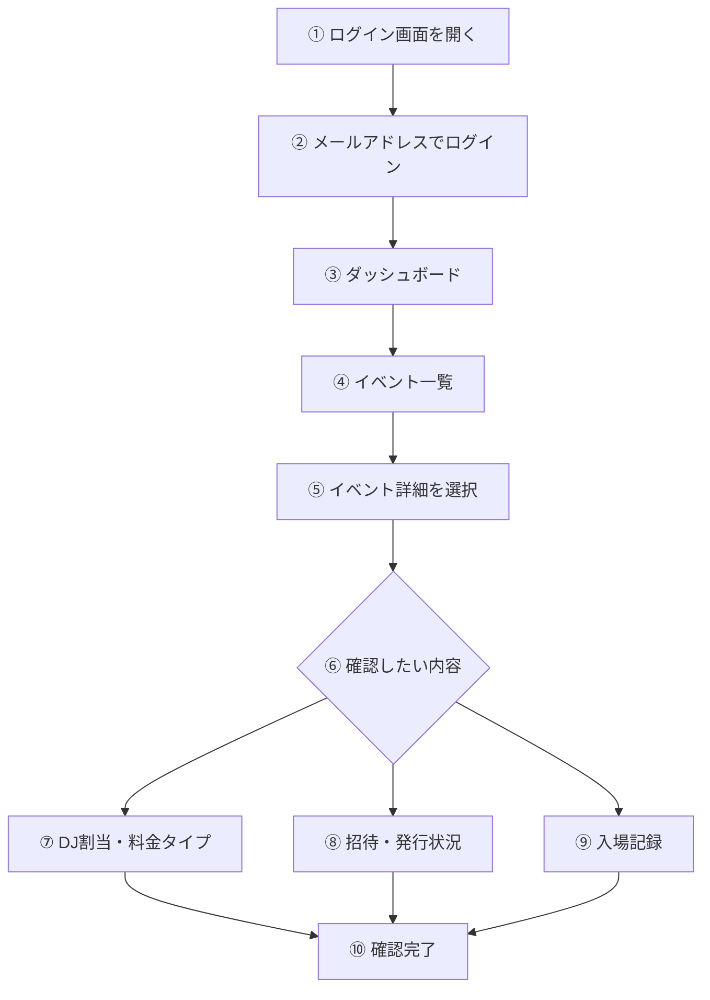
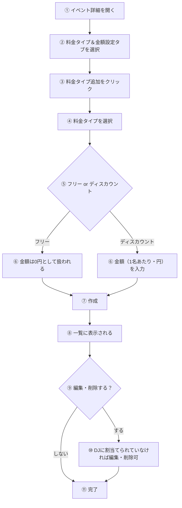
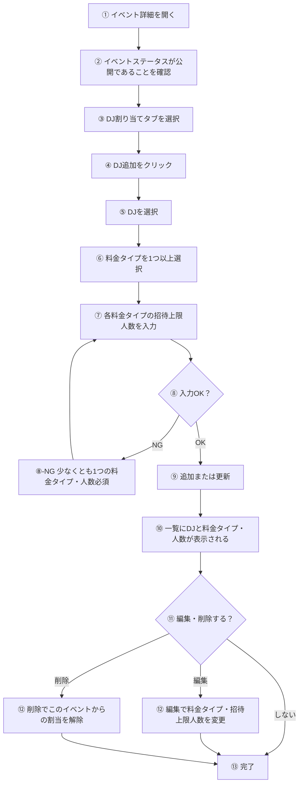

# 使用マニュアル：管理画面

**対象読者**: 管理者・スタッフ（イベント一覧・招待状況・入場記録を確認する方）

---

## 操作フロー図

---

## ログイン・アクセス

1. ブラウザで **http://womb.minami-umemoto.jp/login** を開く（または /admin/login から遷移）
2. メールアドレスに **admin@example.com** を入力
3. ログインを実行（本プロトタイプは簡易認証のため、パスワードを求めない場合があります）
4. ログイン後、**管理画面**（ダッシュボード）に遷移します

---

## 画面項目の説明

1. **ヘッダー**: 「WOMB認証システム(開発デモ版)」、管理画面 / DJ画面 / ENTRANCE へのリンク、ログアウト等
2. **ダッシュボード**: イベント一覧が表示されます。イベント名や日付を確認し、詳細を見たいイベントをクリックします
3. **イベント詳細**: タブまたはセクションで以下を切り替えて確認できます
   - 3-1. **DJ割当・料金タイプ**: イベントに紐づく DJ と料金タイプ（フリー・ディスカウント等）の設定
   - 3-2. **招待・発行状況**: 招待の発行数や招待ごとの状態
   - 3-3. **入場記録**: 入場済み人数や認証ログの概要

（画面キャプチャは別途キャプチャして `images/` に配置してください。）

---

## 操作手順

### イベント一覧を確認する

1. ログイン後、ダッシュボードでイベント一覧を表示
2. イベント名・日付・ステータスを確認
3. 詳細を確認したいイベントの行またはリンクをクリック

### イベント詳細で DJ 割当・料金タイプを確認する

1. イベント詳細画面を開く
2. 「DJ割当」や「料金タイプ」のセクションを表示
3. 割り当てられている DJ と、料金タイプ（フリー／有料・金額）を確認

### 招待・入場状況を確認する

1. イベント詳細画面を開く
2. 「発行状況＆入場記録」タブを表示
3. 各招待の状態（未確認・確認済み・入場済み等）や入場人数を確認

---

## 料金設定方法

料金タイプはイベントごとに「料金タイプ＆金額設定」タブで追加・編集します。**先に料金タイプを作成してから、DJ割り当てで各DJに紐づけます。**

**手順（テキスト）**

1. 管理画面のダッシュボードでイベントを選択し、イベント詳細を開く。
2. **「料金タイプ＆金額設定」** タブをクリックする。
3. **「料金タイプ追加」** をクリックし、モーダルで次を入力する。
   - 3-1. **料金タイプ**: 「フリー」または「ディスカウント」を選択。
   - 3-2. **金額（1名あたり、円）**: ディスカウントの場合は金額を入力。フリーの場合は 0 円として扱われる。
4. **「作成」** で保存する。一覧に料金タイプが表示される。
5. 編集・削除は、**その料金タイプをどのDJ割り当てでも使っていない場合のみ**可能。使用中は編集・削除ボタンが押せません。
6. イベントが「完了」または「閉鎖」の場合は、料金タイプの追加はできない。

---

## DJ割り当て方法

DJ割り当ては「DJ割り当て」タブで行います。**イベントが「公開」のときだけ**追加・編集が可能です（下書き時は不可、完了・閉鎖後は追加不可）。

**手順（テキスト）**

1. イベント詳細を開き、**イベントのステータスが「公開」** であることを確認する（下書きの場合は先に「公開」に変更）。
2. **「DJ割り当て」** タブをクリックする。
3. **「DJ追加」** をクリックする。
4. モーダルで次を設定する。
   - 4-1. **DJ**: プルダウンから割り当てるDJを1人選択。
   - 4-2. **料金タイプ（複数選択可）**: このイベントで使う料金タイプにチェックを入れる。**少なくとも1つ**必須。
   - 4-3. **招待上限人数**: 選択した各料金タイプごとに「招待上限人数」を入力する（0より大きい値が必須）。
5. **「追加」** で保存する。一覧に「DJ名・料金タイプ・料金（1名あたり）・招待上限人数」が表示される。
6. 既存の割り当ては **「編集」** で料金タイプ・招待上限人数を変更、**「削除」** でこのイベントからの割り当てを解除できる。
7. 完了済み・閉鎖済みイベントでは「DJ追加」は押せない。

---

## 招待・発行状況と入場記録で確認できる項目

イベント詳細の **「発行状況＆入場記録」** タブでは、次の内容を確認できます。

### 招待・発行状況で確認できる項目

1. **全体発行状況**
   - 1-1. ゲスト代表者名
   - 1-2. ステータス（招待の状態）
   - 1-3. 総人数
   - 1-4. プラン別割当（料金タイプごとの人数）
   - 1-5. 入場人数（親・子の内訳あり）
   - 1-6. 残利用可能人数
   - 1-7. 合計行（総人数・入場人数・残りの合計）

2. **DJ別発行状況**（上記に加えて）
   - 2-1. DJ名ごとのグループ表示
   - 2-2. 各招待のゲスト代表者名・子代表者名（分割入場時）
   - 2-3. 招待ID / Session ID（親・子の Session 識別子）

### 入場記録で確認できる項目

1. **DJ別入場記録**（入場ログ）
   - 1-1. ゲスト代表者名（親）
   - 1-2. 分割入場代表者名（子で入場した場合の名前）
   - 1-3. 入場タイプ（親／子／一括／分割など）
   - 1-4. 入場人数
   - 1-5. 男性人数
   - 1-6. 女性人数
   - 1-7. スキャン時刻

---

## 用語・注意事項

1. **招待**: DJ がゲスト向けに発行する URL（トークン）1件につき1招待です。1招待で複数名（同伴者）を設定できます。
2. **料金タイプ**: イベントごとに「フリー」「〇〇円」などのプランが定義されています。招待には料金タイプごとの人数枠（pricing_variations）が紐づきます。
3. 本プロトタイプでは、管理画面から招待の「発行」は行いません。招待の発行は DJ 画面で行います。
